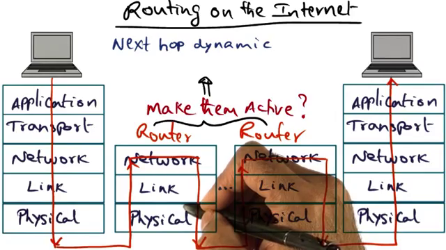
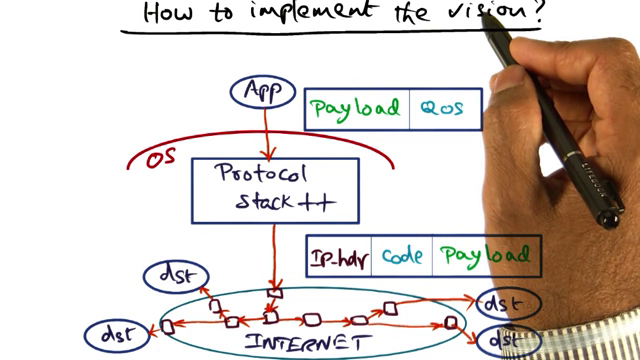
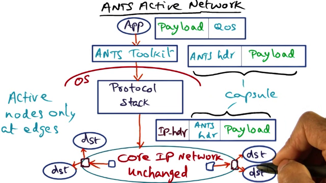
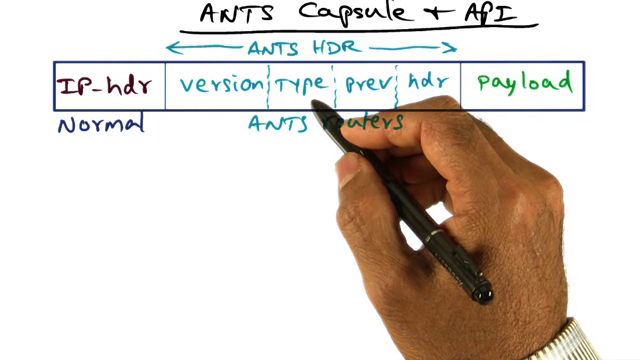
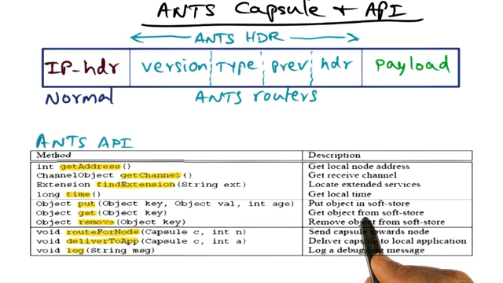

L05 Distributed Systems
============

Work plan
---------

### Resources

1. Videos : 3 h 20 m (total, but only D and E are in scope for final)
2. Papers: 4
3. Quizzes: TBD
4. Exam Review Questions: TBD

### Plan

- Videos:
	Suggested pacing: 1w
		ie 	watch @ 2x speed
			go back and write notes for same time.
- Papers:
	reading: 1 hr
	writing comprehension of paper: 1 hr
	= 4 x 2 hrs = 8 hrs. 
- Quizzes: TBD x 5 mins  = ? min
- Research online and piazza: ? hrs
- Review Exam questions : ?

### Todos

- Find out how firefly rpc fits in
- Is 5c part of scope? ask aditi. study guide has questions from it.
- re-read buildingreliable.pdf
- finish notes on 5e.
- read firefly and x-kernel.

Active Networks:
----------------

### Videos

- Overall idea: make network components such as routers "smart".
- That way the central network traffic reduces and the routing is smart.
- For example, to send the same message across a network like the internet to multiple recipients, the sender's network stack creates multiple copies of the message and routes it through the network to each recipient.
- If all the receipients were located in one part of the network, the message could be sent close enough to all the recipients and *then* replicated. 
- Current routing on internet:

	- packets are sent from source to destination over the network stack
	- each router in the network does nothing with the packet itself; just looks at the routing header and sends it to the next one passively.
	- imagine if the router knew enough about the packet's contents to route it intelligently.
	- we can thus provide "customized service" of messages in the network.
- How to implement the vision:

	- app provides some QoS information about the message to the stack.
	- the enhanced network stack then uses the OoS info to synthesize code that will be run on remote routers to implement the OoS requirement, add the IP header and send it like other packets.
	- On receipt of such a packet, a smart router would read the code and execute it.
- ANTS is one such toolkit. It implements the concept of active networks by enhancing the data packets with code which is executed at the router. This allows for routing to occur based on attributes of the message, not just the destination information.

- How it works:
	- ANTS design:
		- since changing the complex network stack is difficult, ANTS is an app-level toolkit that enhances the packet with its own information.
		- The standard IP payload is enhanced with an ANTS header that contains a reference to code and a link to the previous router. ANTS header + original payload is called a capsule.
		
		- Typically the active nodes are in the edge of the network. The core has regular routers.
	- Message processing:
		
		- If the receiving router is a normal router, regular IP-based routing happens; but if its an Active node, then it processes the message as descibed below.
		- The active node reads the ANTS header and extracts the ref to code ("type" field) and link to prev router.
		- The "reference" is a MD5 hash of the code, not the code itself. Code is transferred between router nodes via a separate mechanism detailed below.
		- Upon receipt of a packet, the router reads the code references and looks it up in its local store of code called soft store. If its found, the router executes the code.
		- If the router cannot find the code or source it from elsewhere, it just drops the packet, expecting higher levels of the stack to handle the packet appropriately.
	- Code creation:
		- Code is written using Java and a restricted API.
		
		- api has 3 sections: routing, soft store and utils.
		- very small api
	- Code transfer and storage:
		- If the code for a packet is not found in the local soft store, the router requests the code from the previous router using information in the packet.
		- Once got, the code is stored in the local soft store for use with other packets as well. If there's no space in the soft store, however, its not stored and the packet is not processed.
- Potential Applications:
	- protocol independent multicast
	- Reliable multicast
	- congestion notification
	- private ip
	- anycasting
	- so generally network functionality, not app
- Pros:
	- Flexible from App POV: Application specific logic can be applied to network packets.
	- Traffic can be handled at the edges of the network instead of through it.
- Cons:
	- Protection Threats: 
		* ANTS runtime safety => Java sandboxing
		* Code spoofing => robust fingerprinting.
		* Softsate integrity => restricted api.
	- Resource Mmgt threats:
		* At the node => restricted api
		* flooding the network => internet already susceptible to this threat
-Roadblocks
	- Router vendors have to be convinced that its OK to open up their product to custom code.
	- Network owners have to be convinced that its OK for other people's code to run on their routers.
	- Software routing cannot match speed needed at the core of the internet bcos its in gigabit speeds.
	- Security of the MD5 hash and the Java sandbox is suspect
- Feasilibity
	- Router vendors not interested in opening up hardware => can do it in the edge
	- sw routing is slower than hw routing => can do it in the edge
	- social + psychological reasons: users dont want code running in router, etc.
- Becuase of the disadvantages, active networks are not popular. 
- However, the concept of defining a network topology above the hardware layer is becoming popular with today's cloud computing and has given a new life to them under the name "Software Defined Networks".

### Papers

5.4.Wet99.pdf:

- structure
	- intro
	- background
	- essentials of ANTS
		- interface
		- implementation
		- ANTS toolkit
		- deployment
	- are capsules feasible?
		- implementing capsules
		- forwarding performance
	- Who can introduce new services?
		- protection
		- resource management
	- what services can be introduced?
		- characterization of services
		- discussion
			- expressible
			- compact and fast
			- incrementally deployable
		- upgrading ants
	-architectural observations
		- value of systematic change
		- dealing with heterogeneous nodes
		- end-to-end argument
		- localizing change
	- conclusions 	

### Exam Questions

1. (4 points) The idea of Active Networks is to “customize” network service to packets flowing through routers. Mention two pitfalls with this idea.

* Protection: can one service damage another (either intentionally or unintentionally)
* Resource management: can one service consume arbitrary amount of resources (e.g., network bandwidth) to the detriment of others
(+2 for each of the above points;
If other points raised then points based on validity of the points)

System from Components:
----------------------

### Videos

- main idea: can a system, in particular a network stack be built from components?
- ... and can it be done such that its hardened and efficient?
- to achieve the "build from components" piece, they used ensemble - a framework for building protocols using microservices. ensemble has about 60 microservices that do most things that network protocols do: sliding windows, fragmentation and reassembly, flow control, etc.
- so while ensemble can be used to build a network stack using its microservices, there are way too many combinations of the microservices for any one collection to be "correct". so instead they use a IOA which is a fw to create specifications for systems. the ioa language is similar to c, so its easy to understand, but it generates specifications ,not code.
	- two kinds of specs are possible: behavioral and properties. behavioral spec defines how the system should behave on particular events, while properties defines the properties that the system should have. Eg: "sends ack on receiving a message" is behavioral vs "all msgs are handled FIFO" is defining it with a property.
	- behavioral specs can be abstract or concrete. abstract ones are non-deterministic descriptions of logic while concrete once can be converted to executable code. the only difference between a spec and implementation is that the latter defines the exact sequence of events while the former doesnt.
- either way, once we have the ioa spec, ensemble has an algorithm that enshrines programmer experiences to come up with a combination of microservices that will match the required spec. This is the unoptimized implementation of the stack.
- this is now optimized using Nuprl: the ocaml code is converted to nuprl and analyzed for common pitfalls such as avoiding gc cycles, marshaling. non-critical pahts, etc.

### Papers

5.5.buildingreliable.pdf:

- structure:
	- intro: idea is to build a network protocol stack using components. goals are **hardening of the protocols** and **improving their efficiency**.its interim, but they have built 4 protocols and proven that a total ordering stack is possible.
	- ensemble, ocaml and nuprl: ensemble is the nw stack building fw, with 60+ microservices. ioa for spec, ensemble for protocol stack, ocaml to write ensemble components, nuprl to validate the ioa spec and the ocaml vs ocaml-opt there's no external change. 
	- specification and correctness
		- specification
		- is ensemble correct?
	- optimization
		- formal optimization in nuprl
			- methodology
			- static opt. of protocol layers
			- dyn opt of app stacks
		- performance results: The resulting stack was found to be better in one protocol and the second best (after handcrafting) in terms of performance.
	- related work
	- conclusion

5.6.HO11.pdf (firefly rpc):

- structure:
	- intro
	- measurements
	- marshalling time
	- analysis
	- improvements
	- fewer processors
	- other systems
	- conclusions

### Exam Questions

1. (3 points) This is in the context of Ensemble/NuPrl approach to combining theory and practice to synthesize communication protocol stacks. Mention two points that capture the goals of this approach.
* Decouple specification, verification, and implementation from one another
* Design, test, optimize individual components (this is the practice part
      achieved via Ensemble)
* Use theoretical framework (achieved via IOA) to go from specification to
synthesizing an un-optimized stack consisting of the components provided by
Ensemble
* Use theoretical framework (NuPrl) to optimize the stack
(+3 if any two of the above points mentioned;
If other points raised then points based on the validity of the points)

Journal
-------
**Tue Apr 15 08:08:57 2014** : Had watched the videos before, but watched them again yesterday night.
**Tue Apr 15 19:25:46 2014** : Watched active networks again, read half the paper and then realized that there's ONE question about it. wrote down the structure of papers. now have to fill in one liner about each section.
Also, where does firefly rpc fit in.
