L07 Distributed Subsystems
==========================

INTRO
-----
- This section gives insights into how complex subsystems can be built. The 3 subsystems we will look at are:
	- GMS: Global memory system: Using peer memory for paging.
	- DSM: Distributed Shared memory: Using cluster memory as if it were a shared memory machine.
	- DFS: Using cluster memory for caching files.

Global Memory System
--------------------

### Videos

- overall idea: can memory available in peers of a cluster be used as a destination for paging memory out? With current gigabit speeds on network, it might be faster than going to local disk.
- on a cluster, each machine has its own VMM that has the cache hierarchy of L1-L3 cache, main memory and disk. Depending on the workload, the pressure for memory on some machines might be low compared to others. The idea of GMS is to see if this unused memory can be spared for those machines where the pressure is high.
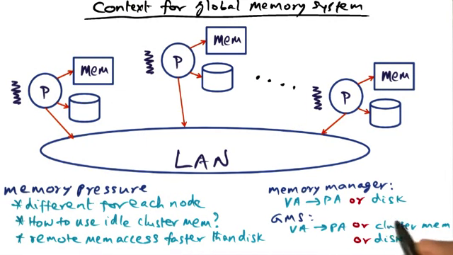
- so the strategy for VM becomes: VA -> PA or clustered memory or disk.
- GMS basics:
	- "cache" = main memory or dram, not processor cache.
	- community approach to handling page faults.
	- physical memory at node broken into:
		- local: working set for processes there
		- global: part of physical memory that can be spared for storing others' pages.
- handling page faults:
	- case 1:

	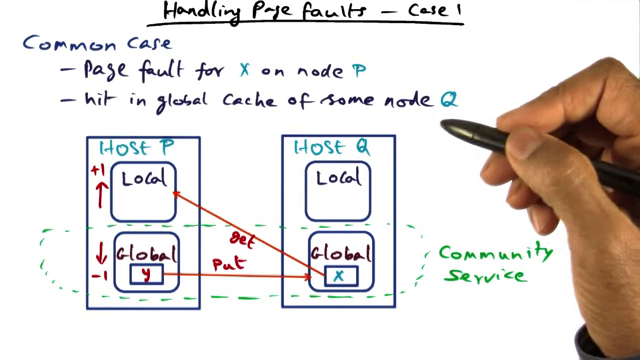
	- case 2
	
	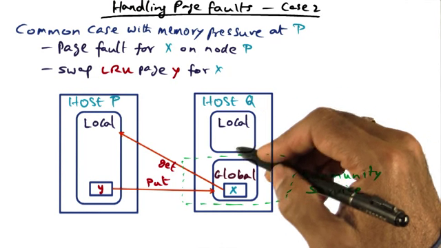
	- case 3
	
	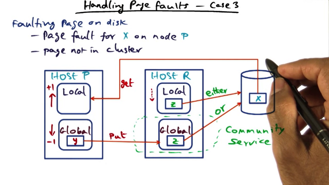
	- case 4
	
	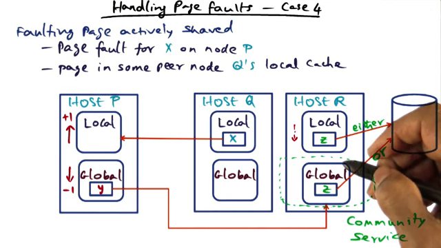
	- summary
	
	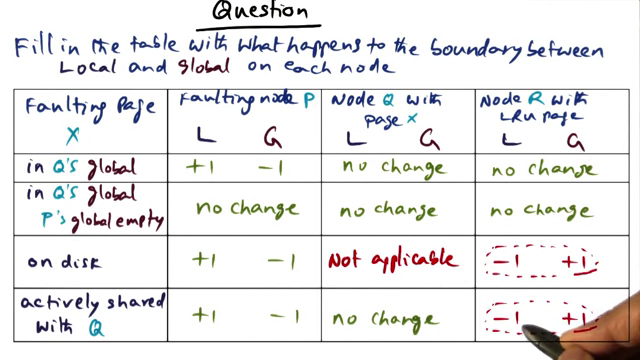
- behavior of algo:
	- idle node becomes a memory server for the cluster
	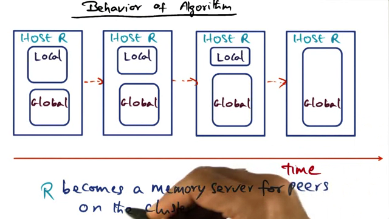
- how to manage keeping the age info up-to-date:
	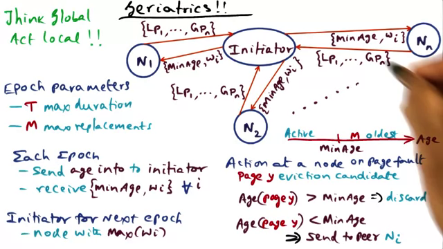
	- solution needs to use as little time as possible and not use a lot of system resources.
	- to do so we have to do it periodically, governed by T (time since last update) or M (number of replacements). the period is called the epoch.
	- updates will be done by one node called initiator, which is picked in each epoch as the node with max old nodes.
	- at start of each epoch, other nodes send the initiator the age info for all pages in it, and the initiator returns a weight wi for each node and an array of minAge values for all nodes.
	- see page fault eviction algo below.
- implementation:
	- before
	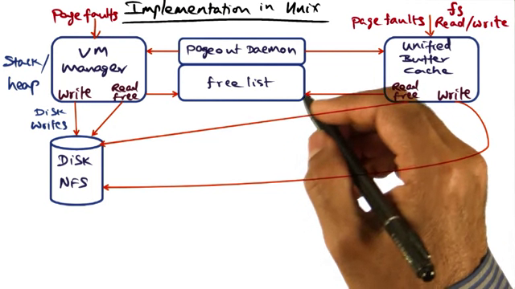
	- after	adding gms
	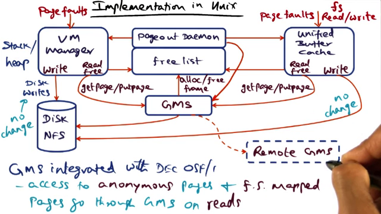
	- data structures required for impl
	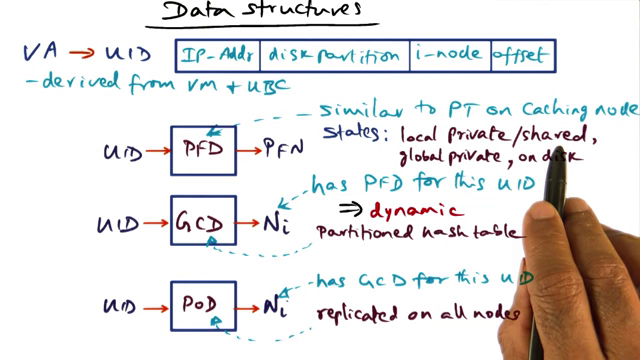
	- putting ds to work:
		- cache hit
		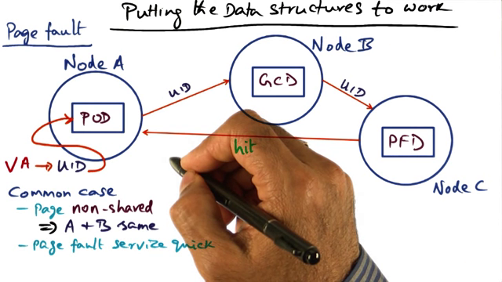
		- cache miss: common case for miss: page could have been evicted and ds not updated. or node could be added/deleted.
		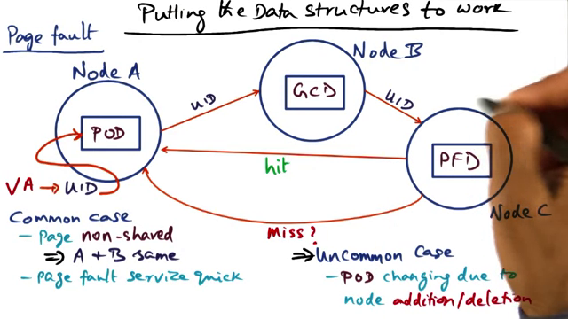

- conclusion
	- enduring concept: there is heavy lifting to be done to take a concept to implementation.
	- gms may not have been applicable to the dec workstations that this was implemented in, but could be applied to the large scale clusters of today.
### Papers

7.1.gms.pdf

- structure
	- intro: makes the case for using clusters as multicomputers and says that on a 20 machine cluster with real world apps running, they got a 1.5-3.5x increase in performance for memory intensive apps.
	- cf to prev work: differences are: integ at lowest level of OS => includes all memory actiivty: paging,memory mapping, files; global management vs independent node's pov to using global memory, gracefully handles add/delete of nodes, implemented in a real os.
	- algorithm
		- basic algorithm
			- all nodes trust each other, but may crash at any time.
			- pages on a node P are local or global: local pages are those belonging to local processes, global are those from processes on other nodes.
				- such that p.local + p.global <= p.totalmemory
			- pages could also be shared or private: two pages on nodes P and Q could have the same content (eg, same shared file memory mapped twice) is shared. pages on global memory are always private.
			- when there's a page fault on node P, one of the following cases is possible:
				- page is in global memory somewhere else, say Q: in this case:
					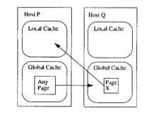
					- copy page from Q.global to P.local
					- copy some page from p.global to q.global
					- net result: P.local.count++, p.global--, Q.global.count 1++,1--, ie unchanged
				- page is in global memory somewhere else, say Q, but P has only local pages
					- copy p.local.lru to q.global
					- copy page from q.global to p.local
					- net result: p.local --,++ ie unchanged, similarly q.global
				- page is in disk, ie evicted from local and global memory
					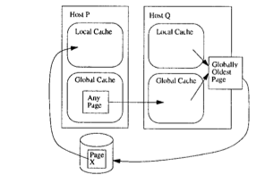
					- page out cluster.lru (which is in Q) to disk
					- copy p.local.lru to q.global
					- copy from p.disk to p.local
					- net result p.local --,++ ie unchanged, q.global++, q.disk++ if reqd.
				- page is in local memory somewhere else, say Q; ie its a shared page.
					- copy from q.local into p.local
					- to make place for this, move p.lru (local or global) to the cluster.
					- to make place for this, move cluster.lru to another node or disk.
					- q unchanged, one of p.local or p.global count changed.
			- ultimate goal: minimize cost of memory refs across the cluster.
			- cost of memory ref depends on where the page is:
				- in local memory: 1000x faster than global or disk
				- in global memory: 2-10x faster than disk.
				- in disk: slowest.
			- thus we might pick a global page over a local one for replacement.
			- the exact function used is a combo of page age and state (ie where it is)	
		- managing global age info
			- management of global age is done periodically, not continuously. 
			- each such period - called epoch - last for T seconds or M replacements, whichever is reached first.
			- each epoch has a manager called the initiator; who is picked by default as the node that had the highest number of old pages in the previous epoch. This makes sense becuase that node is likely to have very less in its working set anyway and can do the managerial work.
			- at the start of the epoch, all nodes send the ages of pages in their local and global memory to the initiator.
			- the initiator sends back:
				- an array of minAge values for all nodes. minAge is the age at which paging to disk will start for that node.
				- a weight for each node that is a measure of how many of the pages in that node are older than minAge. ie, wi = count(page.age > minAge)/count(pages)
			- when a page fault happens, node Ni does one of the following:
				- if page.age > minAge, it discards the page
				- if not, it sends it to No who'se weight is highest, ie has the older pages. one page from that node will be discarded and this page will take its placd.
			- this algo is good bcos:
				- it approximates lru
				- statically decides when to end an epoch: if the node with the largest wi receives M pages, its over.
		- node failure and coherency
			- this algo deals only with clean pages, so no problems when nodes fail.
			- it doesnt handle shared pages, but expects the application to handle consistency, so its no better or worse than other solutions.
		- discussion: it prevents programs that dont use global memory from suffering by: storing pages on idle m/cs, avoiding active nodes, maintain cluster-wise memory cache, doing it in off-peak places.
	- implementation
		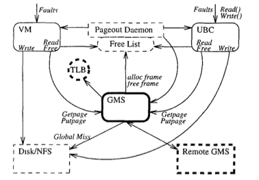
		- changes to existing components:
			- dec has a VMM and a unified buffer cache (ubc) that controls access to file read/writes and memory mapped files.
			- there is also a pageout daemon that evicts pages by calling ubc.
			- gms was added the same level and hooked into all 3.
				- vmm's getpage now calls gms that uses a modified tlb that has page age info. page adds and evicts update this info.
				- similarly ubc's getpage and putpage calls gms.
				- pageout daemon now calls gms as well when paging to disk.
		- basic data structures
			- pages are identified by a universal id: node ip + disk partition # + inode + offset.
			- information about the pages are stored in 3 datastructures:
				- page frame directory(pfd): per node. stores all uid present on the node, both local and global.
				- global cache directory(gcd): per node partial map of ip to uid. the ip2uid hashtable is distributed across the cluster for performance reasons and to enable easy addition/deletion of nodes.
				- page ownership directory(pod): replicated across the whole cluster. maps uid to gcd ip. for non-shared pages, gcd id = self.
		- collecting local age info
			- for pages via ubc, age info is easily got cos they have names.
			- for pages via vmm, they are anonymous. so gms system changed the tlb logic to flush the tlb every minute, and add a flag for each page on the subsequent tlb miss. this flag allows to calculate age of the page.
		- inter-node comm: uses non-blocking comm.
		- addition and deletion of nodes
			- when node is added, it checks in with a master node. master node notifies all current nodes, that then send the new node the portion of the gcd that it should manage.
			- when a node is deleted, master node comes to know of it because it checks all the nodes for liveliness regularly. when it realizes a node is lost, it redistributes the pod and gcd.
		- basic operation of algo
			- on a page fault, a remote getpage operation is executed. on a hit, this returns the page and on a miss, the requested node gets it from disk. the gcd is updated, therefore, as are the pfd's on both nodes.
			- as getpages are executed, the free page list reduces and the pageout daemon wakes up. following the algo mentioned above, it either discards pages above minAge or pushes them to other nodes using putpage. After the page is moved, the pfd and local gcd are updated as are the ones on the node that the page was pushed to. 
	- performance
		- micro benchmarks
			- getpage on a miss shows that gms adds 15 us on the disk access time of 3.6-14.3 kus ie .4-.1% increase.
			- pugpage in 65-102 us range.
			- read times for disk vs gms: 41% better for seq and 700% better for random access.
		- bookkeeping overheads: start epock, collect wi, etc can be desc based on no. of nodes. and for 100 nodes, its .8% extra cpu on initiator and < .2% on the other nodes. impact on nw bw is negligible.
		- exec time improvements
			- running 5 different apps under gms shows that workload speedups of 1.5 to 3.5 was got as idle memory was increased to 200 MB. 
			- The speedups remain constant as the number of nodes were increased.
		- responsiveness to load change: setting 4/8 nodes to no idel memory, overall memory being 150% and then switching nodes in and out to simulate rapid change in total cluster memory still showed 1.9 x increase in speedup at switching every second.
		- effect of idle memory distro: to test this, they implemented n-chance and compared performance speedup with idle=needed and idle = N x needed. gms had ~2.5 speedup even at par.
		- interference with non-idle nodes: tested this by having one node generate gms traffic, and the others synthetically access pages that would be affected by the node. gms had no slowdown, n-chance had 2.5 times.
		- cpu load on idle nodes: client nodes using a remote gms provided didnt choke on cpu, but the node that hosting the pages had 56% utilization due to all the page load requests.
	- limitations:
		- impacted by nw failures. esp crash of master or gcd nodes.
		- doesnt allow dirty pages to be written to gms. can be added.
		- all components trust each other. may not work everywhere.
		- basically lru => one rogue program can cause lot of paging.
		- initiator or gcd activity could hamper local programs
	- conclusion  
		- it works, we proved it :)

### Exam Qns

1. (5 points) Node P has a page fault.
• The oldest page in P’s local cache is X with a timestamp of 40.
• The oldest page in P’s global cache is Y with a timestamp of 30. Which page does P evict and why?
P will evict Y (the oldest page from the global cache). (+2)
Reason: page fault on P is indicative of the working set of P growing, so expand the local cache and shrink the global cache. (+3)

2. b) (7 points) (Treadmarks)
Consider a shared memory multiprocessor. On each processor, read/write to memory is atomic. But there is no guarantee on the interleaving of read/writes across processors.
A parallel program is running on processors P1 and P2. Intent of the programmer:
P1
Modify Struct(A)
The pseudo code that the programmer has written
      flag = 0; initialization
P1
mod(A);
flag = 1;
P2
Wait for modification
Use Struct(A)
to achieve this intent:
P2
while (flag == 0); //spinwait
use (A);
flag = 0;
(i) (4 points) Will the above code work? If not why not?
The above code is not guaranteed to work. (+1 if they get this right)
Reason: read/writes from P1 happen in textual order. But since there is no guarantee on the order in which writes from a given processor become visible to the other, P1’s write to flag may become visible to P2 before the modifications to A by P1 have become visible to P2. This will result in violating the intent of the programmer.
(+3 if they get the reason right; partial credit commensurate with the reasons)
(ii) (3 points) What is the guarantee needed from the memory system to make this code achieve the programmer’s intent?
Sequential consistency:
• Read/writes on each processor respect the program order
• Reads/writes from the different processors interleaved consistent with the
program order on individual processors
(+3 if they say SC; or +1.5 for each of the above two bullets)

(ii) (3 points) What is the guarantee needed from the memory system to make this code achieve the programmer’s intent?
Sequential consistency:
• Read/writes on each processor respect the program order
• Reads/writes from the different processors interleaved consistent with the
program order on individual processors
(+3 if they say SC; or +1.5 for each of the above two bullets)

Distributed Shared Memory
-------------------------

### Videos

### Papers

7.2.computer96.ps.pdf (treadmarks)

- structure:
	- intro
	- shared memory programming
		- api
		- two simple illustations
	- implemenation challenges
	- lazy release consistency
		- release consistency model
		- release consistency implementations
	- multi write protocols
	- the treadmarks system
	- basic operation costs
	- applications
		- mixed integer programming
		- genetic linkage analysis
	- related work
		- alternative programming models
		- alternative dsm implementations
	- conclusions & future work.     

### Exam Qns

Distributed File System
-----------------------

### Videos

### Papers

### Exam Qns

Resources
---------

1. Videos : 3 h 38 m
2. Papers: 4
	update 4/2: one paper reduced, so Papers: 3
3. Quizzes: 3
4. Exam Review Questions: TBD

Plan
----
- Videos: 
	Suggested pacing: 1w
	Watching 3h 48 m = 328 mins = 33 mins/day for 7 days
		ie 	watch @ 2x speed
			go back and write notes for same time.
- Papers:
	reading: 1 hr
	writing comprehension of paper: 1 hr 
	= 3 x 2 hrs = 6hrs.
	to do it in 7 days = 1hr 15 mins per day

- Quizzes: 3 x 5 mins  = 15 min
- Research online and piazza: ? hrs
- Review Exam questions : ?

Total: 3 x 4 hrs + 5.4hrs (ie 328 mins) = 11h 48 min
Breakdown: 1 hr 45 min per day for 7 days  

Todos
-----

Journal
-------
