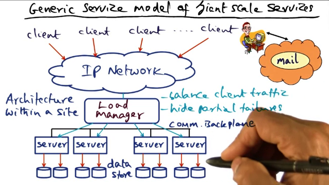
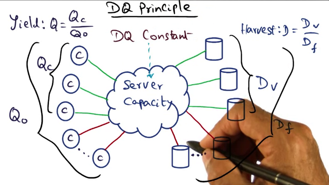
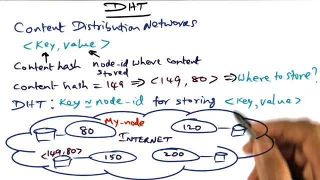
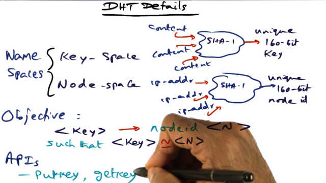

[TOC]

L09 Internet Computing 1
========================
Review material
---------------
### Video content

- Questions answered:
	- what are the issues in managing large data centers?
	- how do you program big data apps, eg, search engines, to run on massively large clusters?
	- how to store and disseminate content on the web in a scalable manner?
- This is what we mean when we say "internet scale computing"
- How:
	- we've already learnt how to build distributed systems.
	- Now we'll see how to harden them for scale in the order of 1000s of processors.
	- Failures are a given at this scale: Not a question of if, but when.
- Examples of giant scale services:
	- Online air reservation
	- email
	- web search
	- watch a streamed movie online
	- make an online purchase
- Lesson outline:
	- System issues in giant scale services
	- Programming models for apps working on big data
	- Content distribution networks

#### Giant Scale Services

- System issues in giant scale services
	- Generic model of a GSS: Such a system consists of:
		
		- A large number of clients accessing the system via a network
		- The IP network that connects clients to the server
		- The "server" which actually consists of:
			- a load manager
			- 1000s of servers that handle requests
			- interconnected to one another through a high b/w communication backplane.
			- 1000s of data stores that the servers are connected to.
		how it works:
			- client requests are all independent of each other. This is called "embarassingly parallel".
				- so all requests can be handled as long as the server has resources.
			- load manager redirects requests to servers such that no particular server is overloaded.
			- load manager also handles partial failures. To do this it monitors the servers to shield the clients from specific servers failing.
			- any of the servers can handle the incoming request.
			- the data could be replicated or partitioned.
	- Implementation: Clusters as the workhorses of GSS
		- Clusters are used to implemente GSS.
		- circa 2000, there were GSS with 300-5000 nodes and 25M-10B req/day.
		- now it is 10x-100x those numbers
		- Each node in the cluster may itself be an SMP
		- Advantages of cluster:
			- absolute scalability: can keep adding more resources without re-architecting the system
			- cost and performance controlled better: since each node is identical to others, maint is easy as is optimizing perf.
			- independent components, so can easily mix and match generational changes in h/w
			- incremental scalability: can scale back if required. This is differnent from above where the focus is on not rearchitecting.
	- How to do load management?
		- it can be done at any layer in the OSI model above network: IP, tcp, socket, mime, http. The higher the level, the more the functionality of the load manager.
			- Eg if its at network level, load manager = dns server that gives out different ip addresses to the same domain name; handling load from multiple clients to specific servers. but this cannot hide lower level IP addresses from clients.
			- Instead if its operating at ip level, ie as level 4 switches (with hot failover), then:
				- can dynamically islate downstream nodes from outside world
				- server specific front end nodes. eg, we're dealing with specific kinds of requests.
				- knows more about semantics of the client-server comm.
				- can behave based on client characteristics
	- DQ Principle:
	
		- Let a GSS have some queries Q that it processes using some Data D. 
		- Not all requests are handled. Qc are the completed queries and Qo is the offered load.
			Now Yield Q = Qc/Qo
		- Each query might require all the data. However, failures or load on server can cause amount data used (Dv) vs Df
			Now Harvest D = Dv/Df
		- the product DQ repsents a system limit:
			- we can increase yield, but reduce harvest or vv.

#### Map Reduce

#### Content Delivery Networks
- Who started and why?
	- Napster, for music sharing
- Basic idea:
	- we need to store content so that it can be accessed over a WAN
	- storing it centrally is not the best way, so we should distribute it so that anyone can find it.
- design questions:
	- how to name it so its universally unique? Ans: use a content hash instead of textual name
	- how to make it finable? Ans: put it in a map with the content hash as key and node id where content is available as value. 
	- where to store the <k,v> pair so it can be found easily? Ans: find a node who's id is the same or close enough to the content hash so when someone else looks for a specific content, they can generate the content hash and find the node id where the content actually is. This is a distributed hash table.
	
- details:
	
	- key name space: content hash using some algo like SHA1 to create 160 bit key
	- value name space: hash of ip address using same algo to create 160 bit key
	- Objective: store key in a node such that k ~ N.
	- api: putkey, getkey
- next problem: getKey(hash) still gives only the hashed ip address, how to find the actual ip address and reach it?

### Paper Content
### Previous Exam questions and answers

#### CS 6210 Spring 2013 Final Solution Name:__________Kishore___GT Number: _________
6. Internet Scale Computing (20 mins, 20 points)
(a) (4 points) (Map/Reduce)
Mention at least 4 important “heavy lifting” work done by the map-reduce infrastructure unbeknownst to the user of the programming model (use a figure if it makes easier to get your points across).
	 Automatic splitting of input into key-value pairs
	 Spawning worker threads to execute parallel maps
	 Spawning worker threads to execute parallel reduce
	 Managing the scheduling of the worker threads
	 Plumbing intermediate results from the map to reduce worker threads
	 Managing machine failures and re-execution of failed map/reduce functions
(+1 for each of any of the above points upto 4 max; other points also considered if valid)

(b) (6 points) (Giant-scale services)
Explain the pros and cons of the three approaches to online evolution of giant- scale services:
(i) Fast reboot
Pro: whole datacenter up in a short amount of time; especially works well in exploiting diurnal server property for geographical datacenters across the globe (+1)
Con: No service (DQ = 0) for the duration of the reboot time (+1)
(ii) Rolling upgrade
Pro: graceful degradation of service (DQ never goes to zero) (+1)
Con: takes a long time for the datacenter to be fully functional again (+1)
(iii) Big flip
Pro: better than fast reboot in terms of availability (DQ is exactly 50% for the duration of total reboot time) (+1)
Con: worse than fast reboot in the time it takes for the datacenter to be fully operational (+1)
(c) (10 points) (Coral)
(i) (2 points) Explain “full” and “loaded” attributes of nodes participating in Coral
Full: the node already has a predefined number of “values” associated with a given key (basically helps in statically dispersing the meta data management for popular content)
(+1)
Loaded: the node is already handling a predefines number of queries per unit time for a given key (basically helps in dynamically dispersing the meta data management for popular content)
(+1)

#### CS 6210 Fall 2011 Final Solution with Grading Rubric Name:__________Kishore_________GT Number: _________
6. Internet Scale Computing (25 min, 20 points)
(a) (5 min, 5 points) (Giant-scale services) What do “D” and “Q” stand for in the DQ principle? Explain how the DQ principle helps in handling graceful degradation of giant scale services.

o D is the data in the giant-scale service
o Q is the“Yield”definedasQ=Qc/Qo,whereQcisthequeriescompleted,andQoisthequeries offered to the giant-scale service in a given time period
o Gracefuldegradation:
o DQisaconstantforasystemcapacity
o Ifsystemcapacitygoesdown(duetofailure,routinemaintenance,etc.)
 Keep harvest (D) unchanged and reduce the Yield (Q)
 Reduce harvest (D) and keep the Yield unchanged (Q
 Allows system administrator to make an explicit choice as to which to preserve
and which to sacrifice

“Harvest” defined as D = Dv/Df, where Dv is the available data, and Df is the complete
           +1 for each highlighted phrase or equivalent
           +1 for the two bullets identified above
(b) (5 min, 5 points) (Coral CDN) Explain the metadata server overload that can happen in a traditional DHT with an example.
o Assume 10 nodes each generate content. Assume that the hashed keys for all the 10 generated content are all clustered around the IP-address hash of one particular node say N1. In this case the key-value pairs, <key1, node-id1>, <key2, node-id2>, ..., <key10, node-id10> will all be stored in the same node N1. If all these 10 generated content are the most popular content in the CDN, then, even though the content themselves are hosted on distinct nodes, the discovery of the content location requires accessing the metadata stored in N1. This leads to an overload of the metadata server N1.
++++
+5 if the answer says that a lot of hashed content keys are clustered
   around the hash of the IP address

(c) (15 min, 10 points) (Map-Reduce) Show pictorially a Map-Reduce structure (you don’t have to write the code for map and reduce functions) for ranking the pages on the web. Be explicit in identifying the <key, value> of the map and reduce functions both for input and output.

o <Key,value>inputtomap function:
o <sourceURL,contentof the source page>
o <Key,value>outputofMapand input to Reduce
o <targetURL,URLof source page where found>
o <Key,value>outputofReduce o <targetURL,rankofthe
target URL>

10. (10 min, 5 points) (Map/Reduce)Write a Map/Reduce program that counts the URL access frequency. The input to the map/reduce system are web logs of page requests. The final output should be <URL, total-count>

11. (5 min, 5 points) (Giant Scale Service)
DQ Principle: If D is data per query and Q is the number of queries per second, then the product D*Q tends towards a constant for a fully utilized system. How can the DQ principle be used to come up with policies for graceful degradation of the system under excess load?

Resources
---------

1. Videos : 2 h 34 m
2. Papers: 7 (adding the 2 papers from "Web technologies" to this lesson)
	update: 4/2 removed 3 addnl and 2 from original list = 5 reduced.
	thus papers = 2
3. Quizzes: TBD
4. Exam Review Questions: TBD

Plan
----
- Videos:
	Suggested pacing: 2w
	Watching 2h 34 m = 154 mins = 11 mins/day for 14 days
		ie 	watch @ 2x speed
			go back and write notes for same time.
- Papers:
	reading: 1 hr
	writing comprehension of paper: 1 hr
	= 2 x 2 hrs = 4 hrs. 
- Quizzes: TBD x 5 mins  = ? min
- Research online and piazza: ? hrs
- Review Exam questions : ?

Total: 2 x 2 hrs + 2.5hrs (ie 154 mins) = 6h 34 min

Todos
-----

Journal
-------
**Fri Apr  4 01:30:53 2014** : Started watching videos this evening.
**Fri Apr  4 01:42:37 2014** : Looking at previous exams now.
**Fri Apr  4 01:55:19 2014** : Did a quick persual of the Map reduce paper. Need to go look at the details but it is as i remembered it from before. Also looked at the Coral paper. Need to read that paper fully, esp about Distributed Sloppy Hash table.

**Sun Apr  6 06:34:20 2014** : Finished watching the cdn videos and read the coral paper a little bit more in detail. Still need to read it thoroughly and create notes for it. Also still need to create notes for the latter half of the cdn videos as well as the MR videos.

